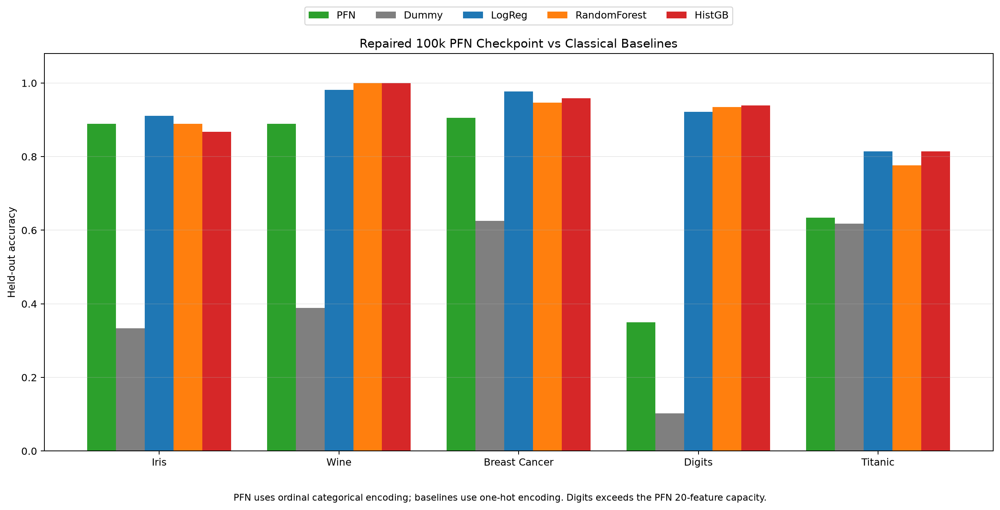
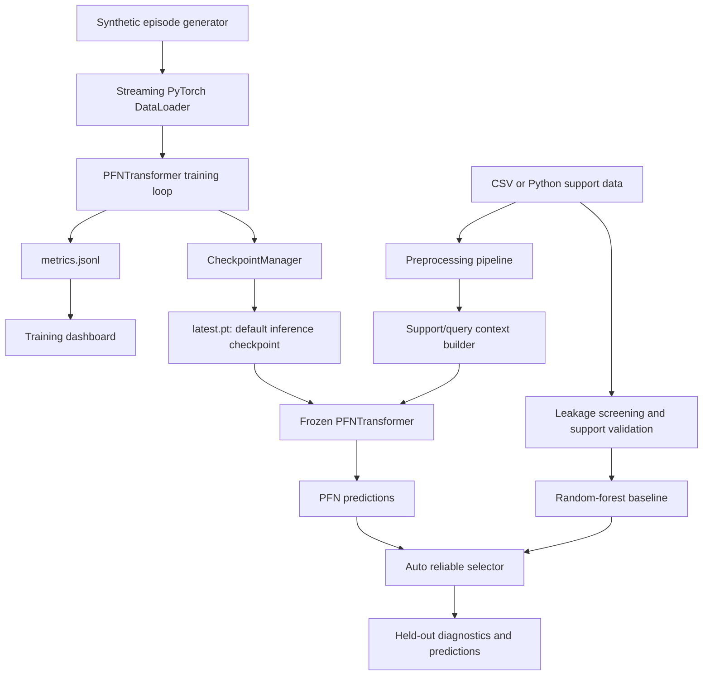
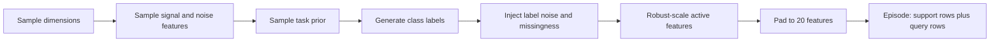
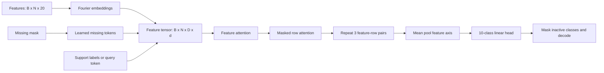
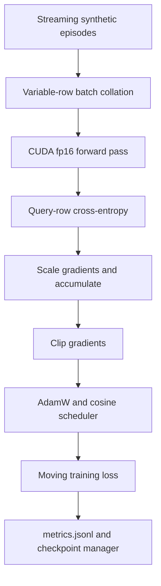
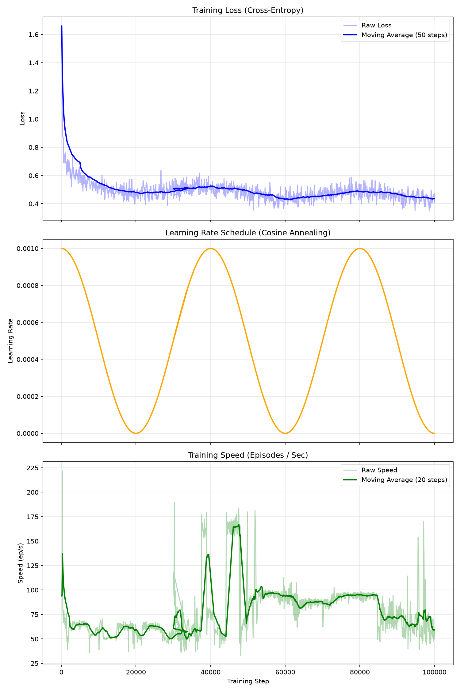
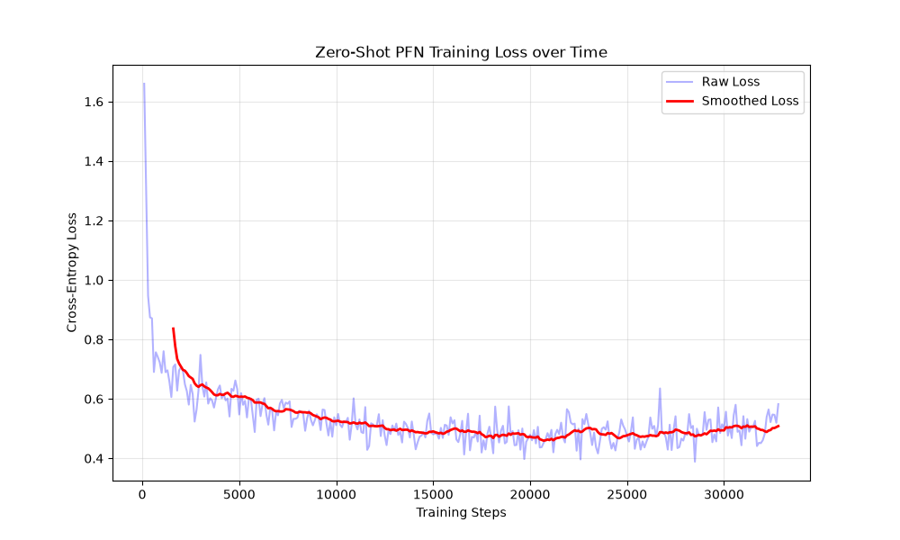
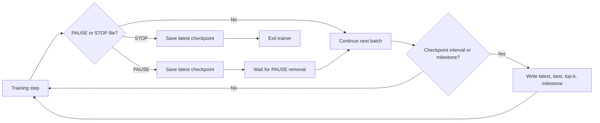
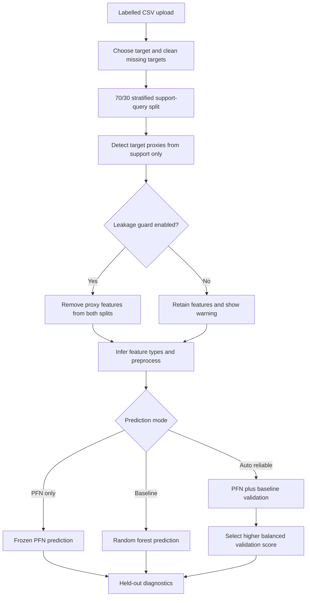

# Zero-Shot Tabular PFN

> **Disclaimer**: This model is currently still in the training phase. At present, it has achieved few-shot capabilities rather than true zero-shot performance. Work is ongoing to reach the zero-shot goal.

A compact Prior-Fitted Network (PFN) prototype for small tabular classification tasks. The project pretrains a Transformer on synthetic support/query episodes, then uses the frozen model as an in-context classifier for a new labelled support set and unlabelled query rows.

## Current Status

The project has now successfully scaled to a **10M Parameter Cloud-Hosted Architecture**. Using Modal.com, the training pipeline (`modal_train.py`), evaluation harness (`modal_eval.py`), and the Streamlit UI (`modal_gui.py`) have all been moved to remote serverless infrastructure (A100 GPUs) to bypass local hardware limitations. 

The local 1M parameter prototype remains functional (`runs/main_run/checkpoints/latest.pt`), but the newly trained 10M parameter model (`runs/modal_run_10m_budget_v6/checkpoints/milestone_28000.pt`) drastically outperforms it on continuous high-dimensional datasets. The cloud UI now allows dynamically toggling the 10M parameter architecture for live zero-shot inference.

The PFN currently uses ordinal encoding for categorical data, which causes the highly expressive 10M parameter model to overfit on datasets with un-ordered text categories (e.g., Titanic). A fix (`OneHotEncoder`) is slated for the next iteration.

## Contents

- [What this project does](#what-this-project-does)
- [Verified performance and evaluation policy](#verified-performance-and-evaluation-policy)
- [System architecture](#system-architecture)
- [Repository map](#repository-map)
- [Installation](#installation)
- [Run the application](#run-the-application)
- [Use the PFN API and CLI](#use-the-pfn-api-and-cli)
- [Train, resume, monitor, and evaluate](#train-resume-monitor-and-evaluate)
- [Data handling and leakage protection](#data-handling-and-leakage-protection)
- [Checkpoint policy and recovery](#checkpoint-policy-and-recovery)
- [Tests and quality checks](#tests-and-quality-checks)
- [Known limitations and next work](#known-limitations-and-next-work)

## What This Project Does

### Pure PFN inference

The frozen `ZeroShotClassifier` follows the PFN workflow:

1. A caller supplies `X_support` and `y_support`.
2. The classifier label-encodes the support labels and retains them as in-context examples. It does not update model weights.
3. Query rows are combined with a stratified sample of at most 80 support rows.
4. The model predicts query rows in chunks, with support plus query length capped at 120 rows per forward pass.
5. Internal class IDs are decoded to the original label values.

This model accepts 2 to 10 classes and at most 20 preprocessed features. Direct API callers must supply numeric features with no more than 20 columns. The evaluation pipeline and Streamlit app prepare numeric, categorical, and optional text columns before invoking the PFN.

### Streamlit prediction modes

| Mode | Behaviour | Training performed on uploaded support rows? |
| --- | --- | --- |
| `Auto reliable` | Fits both the frozen PFN and a random-forest baseline. It selects the higher support-validation balanced accuracy. | Baseline only |
| `PFN only` | Uses only the frozen checkpoint. | No |
| `Classical baseline` | Uses only the random-forest baseline. | Yes |
| `Untrained PFN dry run` | Uses random PFN weights for wiring checks. It is expected to be poor. | No |

The app requires a labelled CSV because it reserves a held-out query set to display evaluation accuracy. It is an evaluation tool, not an unlabelled production scoring endpoint.

## Verified Performance and Evaluation Policy

### Checkpoint identity

| Artifact | Verified state |
| --- | --- |
| `runs/main_run/checkpoints/latest.pt` | Step `100000`, recorded loss `0.4099510070` |
| `runs/main_run/checkpoints/best.pt` | Repaired to match the verified 100k checkpoint |
| `runs/main_run/checkpoints/milestone_100000.pt` | Matches the verified 100k checkpoint |
| Default inference path | `runs/main_run/checkpoints/latest.pt` |

The stored field is named `val_loss`, but the current training loop records an exponential moving average of query training loss. It is not a separately evaluated validation loss and must not be interpreted as one.

### Standard benchmark results

These are single 70/30 stratified splits generated by `python -m zeroshot_pfn.evaluate` after checkpoint repair. The PFN uses ordinal encoding for categoricals; baselines receive one-hot encoding, so this is a diagnostic comparison rather than a perfectly representation-matched contest.

| Dataset | PFN (10M Cloud) | PFN (1M Local) | Dummy | Logistic regression | Random forest | HistGradientBoosting |
| --- | ---: | ---: | ---: | ---: | ---: | ---: |
| Iris | 91.1% | 88.9% | 33.3% | 91.1% | 88.9% | 86.7% |
| Wine | 96.3% | 88.9% | 38.9% | 98.1% | 100.0% | 100.0% |
| Breast Cancer | 93.6% | 90.6% | 62.6% | 97.7% | 94.7% | 95.9% |
| Digits | **58.9%** | 35.0% | 10.2% | 92.2% | 93.5% | 93.9% |
| Titanic | **38.2%** | 63.4% | 61.8% | 81.4% | 77.6% | 81.4% |

Digits has 64 raw features and is well beyond the PFN's 20-feature context budget. Its result is not an appropriate success criterion for this architecture.

### Evaluation run artifact

The chart below is regenerated from `runs/main_run/evaluation_results.md`, so it matches the repaired-checkpoint table above.



### Supplied GUI examples

The following are five repeated 70/30 stratified held-out evaluations using the leakage guard described below.

| Dataset | Leakage-screened feature removal | Auto/baseline accuracy | Balanced accuracy |
| --- | --- | ---: | ---: |
| `example/customer_churn.csv` | `Customer_Feedback` | 71.53% +/- 2.95% | 67.42% +/- 2.66% |
| `example/loan_approval.csv` | None | 80.80% +/- 1.41% | 79.36% +/- 1.85% |

Without screening, `Customer_Feedback` maps every observed feedback value to exactly one churn label and yields an artificial 100% random-holdout score. That is target leakage or a post-outcome proxy, not a trustworthy model result.

### Current PFN limitation

On the two supplied mixed-type datasets, PFN-only prediction collapsed to a single majority class:

| Dataset | PFN-only held-out accuracy | Prediction pattern |
| --- | ---: | --- |
| Customer churn | 65.00% | All rows predicted as class `0` |
| Loan approval | 59.67% | All rows predicted as `No` |

One-hot categorical preprocessing and label-permutation ensembling were tested against the checkpoint and did not change this collapse. The underlying checkpoint needs retraining before the pure PFN should be treated as a reliable real-data classifier.

## System Architecture



### 1. Synthetic prior generation

`src/zeroshot_pfn/generator.py` creates every training episode in memory. It samples:

- 20 to 80 support rows and 10 to 40 query rows;
- 4 to 20 features;
- 2 to 10 classes;
- 40% to 85% nuisance/noise features;
- 0% to 2% label noise; and
- 0% to 10% missing values via a mix of MCAR and MAR mechanisms.

Each active feature uses a randomly selected marginal distribution: Gaussian, Gaussian mixture, Student-t, uniform, beta, gamma, log-normal, Zipf-like categorical, or Dirichlet categorical. Features are robustly scaled per episode with quantile clipping, median/IQR normalization, and a final `[-1, 1]` clip.

Label-generating tasks are sampled from a mixture of axis-aligned tree, linear/GLM, random MLP, structural-causal-model, and random-Fourier-feature Gaussian-process priors. For tasks with five or more classes, the generator emphasizes tree and linear tasks to preserve learnability.



### 2. Episode contract

An `Episode` holds the following fixed-shape tensors:

| Field | Shape | Meaning |
| --- | --- | --- |
| `x` | `[N, 20]` | Active features plus zero-padded columns |
| `y` | `[N]` | Integer class labels |
| `is_query` | `[N]` | `True` for query rows |
| `feature_mask` | `[20]` | Active feature columns |
| `missing_mask` | `[N, 20]` | Missing input cells and padded columns |
| `n_classes` | scalar | Number of active classes |
| `n_features` | scalar | Number of active columns |

### 3. PFNTransformer

The implementation in `src/zeroshot_pfn/model/transformer.py` instantiates a 6-block model: three feature-attention blocks alternating with three row-attention blocks. The runtime model uses `d_model=128`, `n_heads=4`, and `d_ff=512`; its output head always has 10 logits, with inactive classes masked to `-10000`.

#### Input embedding

- Every scalar feature is mapped through fixed random Fourier features, then LayerNorm.
- Each padded or missing value is replaced by a learned per-column missing token.
- Support labels receive a learned label embedding.
- Query labels are replaced by a learned query token, so their true labels are never exposed to the model.

#### Feature attention

Feature attention reshapes the state from `[B, N, D, d_model]` to `[B*N, D, d_model]`. Columns can interact within each row, allowing the model to form feature combinations.

#### Row attention and causal rule

Row attention reshapes to `[B*D, N, d_model]` and applies a boolean attention mask. Support rows cannot attend to query rows, and no row can attend to padded rows. Query feature tokens may attend to support rows and query feature tokens, but query labels remain hidden by the query token. This prevents support labels from leaking from query rows during training or inference.

#### Prediction head

The model average-pools its feature states to a row representation and applies a linear 10-class head. Inference slices the logits to the actual class count before choosing the maximum and decoding the original label values.



### 4. Training flow

The training command creates a streaming episode dataset, batches with variable-row padding, and trains with:

- AdamW, learning rate `1e-3`, weight decay `1e-4`;
- CUDA fp16 autocast and `GradScaler`;
- gradient clipping at norm `1.0`;
- batch size `8`; and
- gradient accumulation across `2` loop iterations.

The current code consumes eight newly generated episodes per loop step. With two-step accumulation, a nominal 100,000-step run consumes approximately 800,000 synthetic episodes and performs approximately 50,000 optimizer updates. The CLI help text's claim of 16 episodes per step is outdated; do not use it to estimate the training exposure.

Query-row cross entropy is the training objective. The current implementation uses an exponentially weighted moving training loss for monitoring and checkpoint ranking; it does not run a separate validation dataset.



### Training run artifacts

The metrics image summarizes recorded loss, learning-rate, and speed events through the 100k run. It is training telemetry, not a validation curve.



The smaller loss chart is an early-run artifact and is included for traceability.



### 5. Checkpointing and controls

`CheckpointManager` maintains:

- `latest.pt` after every checkpoint save;
- `best.pt` only when its numeric, finite score improves;
- up to three `top_k/step_*_loss_*.pt` artifacts; and
- fixed milestones at 100k, 250k, and 500k steps.

The training process polls `runs/main_run/.control/PAUSE` and `runs/main_run/.control/STOP`. A pause or stop writes the current checkpoint before waiting or exiting.



### 6. Inference and preprocessing

The evaluation pipeline uses a `ColumnTransformer`:

| Feature type | PFN preprocessing | Baseline preprocessing |
| --- | --- | --- |
| Numeric | Median imputation, `StandardScaler` | Median imputation, `StandardScaler` |
| Categorical | Most-frequent imputation, ordinal encoding, `StandardScaler` | Most-frequent imputation, one-hot encoding |
| Text | Empty-value fill, SentenceTransformer, PCA to 5 dimensions, `StandardScaler` | Same text transform |

After transformation, `OptionalSelectKBest` caps the feature count at 20. This matches the PFN's hard input width and also keeps baseline input bounded. Ordinal categorical encoding is a known PFN limitation because arbitrary category order can appear meaningful to a continuous-value model.

### 7. Streamlit evaluation flow

The app:

1. Uploads a labelled CSV and defaults the target selector to the final column.
2. Drops rows with a missing target.
3. Bins a continuous numeric target into five quantile classes; rejects nonnumeric targets with more than 10 classes.
4. Makes a fixed 70/30 stratified support/query split by default.
5. Detects likely target proxies using only support rows.
6. Optionally removes those proxy features from both support and query data.
7. Fits the selected prediction mode.
8. In Auto mode, uses a second split inside the support data to select PFN or baseline by balanced accuracy.
9. Displays held-out query accuracy, prediction diversity, selected features, per-model diagnostics, and row-level predictions.



## Repository Map

| Path | Responsibility |
| --- | --- |
| `app.py` | Leakage-screened Streamlit evaluation application |
| `dashboard.py` | Training metrics dashboard reading `metrics.jsonl` |
| `predict.py` | CSV support/query PFN-only CLI predictor |
| `src/zeroshot_pfn/config.py` | Dataclass configuration contracts |
| `src/zeroshot_pfn/data.py` | Episode contract, seed helpers, checkpoint metadata helpers |
| `src/zeroshot_pfn/generator.py` | On-the-fly synthetic episode generation |
| `src/zeroshot_pfn/priors/` | Feature distributions and task-function priors |
| `src/zeroshot_pfn/model/` | Fourier/missing embeddings, dual-axis attention, PFNTransformer |
| `src/zeroshot_pfn/train.py` | Streaming training loop |
| `src/zeroshot_pfn/train_control.py` | Pause/stop controls and checkpoint rotation |
| `src/zeroshot_pfn/predictor.py` | scikit-learn-style frozen PFN wrapper |
| `src/zeroshot_pfn/evaluate.py` | Benchmark evaluation and preprocessing pipelines |
| `src/zeroshot_pfn/text_extension.py` | SentenceTransformer plus PCA text transformer |
| `src/zeroshot_pfn/monitoring.py` | JSONL telemetry writer |
| `runs/main_run/checkpoints/` | Current checkpoint artifacts |
| `reports/` | Evaluation outputs and diagnostics |
| `tests/` | Unit, shape, masking, generator, training-control, and smoke tests |

## Installation

Use Python 3.10 or newer. On Windows PowerShell:

```powershell
py -3.12 -m venv .venv
.venv\Scripts\Activate.ps1
python -m pip install --upgrade pip
python -m pip install -e .
```

For optional text support and the broader local tool set:

```powershell
python -m pip install -r requirements.txt
```

`sentence-transformers` downloads or loads `all-MiniLM-L6-v2` the first time a text column is processed.

## Run the Application

### Streamlit evaluation UI

```powershell
.venv\Scripts\streamlit.exe run app.py --server.port 8501
```

Open `http://localhost:8501`. Leave **Exclude likely target proxies** enabled unless a domain owner has established that the detected feature is valid at prediction time.

### Training dashboard

```powershell
.venv\Scripts\streamlit.exe run dashboard.py --server.port 8502
```

Set the run directory to `runs/main_run` to read `runs/main_run/metrics.jsonl`.

## Use the PFN API and CLI

### Python API: already numeric data

```python
from zeroshot_pfn.predictor import ZeroShotClassifier

classifier = ZeroShotClassifier(
    checkpoint_path="runs/main_run/checkpoints/latest.pt"
)
classifier.fit(X_support_numeric, y_support)
predictions = classifier.predict(X_query_numeric)
```

`ZeroShotClassifier` does not currently implement `predict_proba`. Use `predict` for the supported public inference result.

### Python API: mixed-type data

```python
from zeroshot_pfn.evaluate import build_pipeline
from zeroshot_pfn.predictor import ZeroShotClassifier

pipeline = build_pipeline(
    ZeroShotClassifier(),
    is_pfn=True,
    num_cols=["age", "income"],
    cat_cols=["plan", "region"],
    text_cols=[],
)
pipeline.fit(X_support, y_support)
predictions = pipeline.predict(X_query)
```

### CLI predictor

The support CSV must contain the target column. The query CSV may include it for evaluation or omit it for prediction-only output.

```powershell
.venv\Scripts\python.exe predict.py `
  --support examples\iris_train.csv `
  --query examples\iris_test.csv `
  --target target `
  --checkpoint runs\main_run\checkpoints\latest.pt `
  --out example\predictions.csv
```

The CLI is PFN-only. It does not apply the Streamlit app's Auto mode or target-proxy screen.

## Train, Resume, Monitor, and Evaluate

### Train or resume the main run

```powershell
.venv\Scripts\python.exe -m zeroshot_pfn.train --total-steps 100000
```

`runs/main_run/checkpoints/latest.pt` is loaded automatically when present, so the command resumes from its stored step. Do not reuse an already completed `100000` target when intending to continue training; choose a larger total step value.

### Short pilot

```powershell
.venv\Scripts\python.exe -m zeroshot_pfn.train --pilot
```

### Pause or stop training

```powershell
New-Item -ItemType File runs\main_run\.control\PAUSE
Remove-Item runs\main_run\.control\PAUSE

New-Item -ItemType File runs\main_run\.control\STOP
```

### Evaluate the current checkpoint

```powershell
.venv\Scripts\python.exe -m zeroshot_pfn.evaluate `
  --checkpoint runs\main_run\checkpoints\latest.pt `
  --out reports\evaluation_results.md
```

### Run tests and linting

```powershell
.venv\Scripts\python.exe -m pytest tests -q
.venv\Scripts\ruff.exe check app.py src tests predict.py
```

The repaired project state was verified with 26 passing tests and a clean lint check on the edited application.

## Data Handling and Leakage Protection

### Why the app can reject a perfect score

A row-level random split does not make a score valid when a feature is recorded after the outcome or directly encodes the label. The app scans support data for discrete columns whose well-observed values map deterministically to a single target class over at least 90% of support rows. Such columns are marked as likely proxies.

The screen does not prove causality. It identifies a high-risk evaluation condition. A domain owner must decide whether the column is available at the real prediction time. The default is conservative: exclude detected proxies from both support and query features.

### Recommended evaluation practice

1. Establish the prediction timestamp and remove post-outcome fields before modelling.
2. Use time, group, or entity-aware splits when rows are correlated, rather than a random split.
3. Compare accuracy with balanced accuracy for class-imbalanced targets.
4. Repeat the split or use cross-validation before making a performance claim.
5. Keep the raw PFN score separate from the Auto-mode score.

## Checkpoint Policy and Recovery

An earlier `best.pt` artifact incorrectly pointed to a step-242 checkpoint with a recorded zero loss. That artifact produced poor benchmark results and made the application appear untrained. The following recovery was completed:

1. Verified `latest.pt` and `milestone_100000.pt` were both step 100000 with loss `0.4099510070`.
2. Replaced the stale `best.pt` with the verified latest artifact.
3. Repaired the top-k entry to the same verified 100k artifact.
4. Changed inference defaults in the API, CLI, and evaluation tool to use `latest.pt`.
5. Hardened checkpoint ranking so missing or non-finite scores cannot become `best.pt` or a top-k record.
6. Restored the moving loss correctly on resume instead of restarting it as zero.

## Tests and Quality Checks

The suite covers configuration, data contracts, synthetic generation, preprocessing, model shapes, causal masking, toy convergence, monitoring, checkpoint control, and a short training smoke test. The most recent full run reported `26 passed`.

For local acceptance after changes:

1. Run `pytest`.
2. Run Ruff on edited Python files.
3. Run the benchmark evaluator with the default checkpoint.
4. Exercise Streamlit with `customer_churn.csv` and verify that `Customer_Feedback` is detected and removed by default.
5. Confirm that PFN-only diagnostics are visible separately from Auto mode.

## Known Limitations and Next Work

### Current limitations

- Pure PFN inference can collapse to class 0 on some real categorical datasets.
- Categorical data reaches the PFN through ordinal codes, which creates arbitrary numeric ordering.
- The training prior underrepresents real mixed-type datasets, class-label permutations, and business-style categorical mechanisms.
- The training checkpoint score is a moving training loss, not a held-out validation measure.
- Direct PFN API usage requires numeric preprocessed data with no more than 20 columns.
- The CLI does not yet expose the Auto reliable mode, target-proxy screen, text detection, confidence output, or probability output.
- The app's continuous-target path is bucketed classification, not regression.

### Recommended PFN retraining plan

1. Add random class-label permutation augmentation to every synthetic training episode.
2. Add richer categorical mechanisms and realistic mixed numerical/categorical feature generation to the prior.
3. Train and rank checkpoints on a fixed synthetic validation stream that is separate from training batches.
4. Add an external real-data validation suite with time/group-aware splits where appropriate.
5. Track per-class recall, balanced accuracy, calibration, and prediction diversity, not only aggregate accuracy.
6. Do not promote PFN-only mode until it beats a dummy baseline and produces more than one class on representative validation sets.

## Documentation Index

- `EOD_30AUG.md`: latest end-of-day record documenting the successful 10M Parameter Cloud Scaling and Live UI deployment.
- `cloud_scaling_report.md`: deep dive into the 10M parameter architectural changes, budget constraints, Modal configuration, and benchmark results against the 1M parameter model.
- `eod_report_aug29.md`: previous end-of-day record with the 1M checkpoint, GUI, leakage, and validation findings.
- `.agents/CODEX_MEMORY.md`: concise durable state for future Codex work.
- `.agents/PROJECT_STATE.md`: architectural context plus a current-status addendum.
- `reports/evaluation_results.md`: 1M benchmark table generated by the evaluator.
- `reports/eval_best_repaired.md`: repaired-checkpoint evaluation record.
